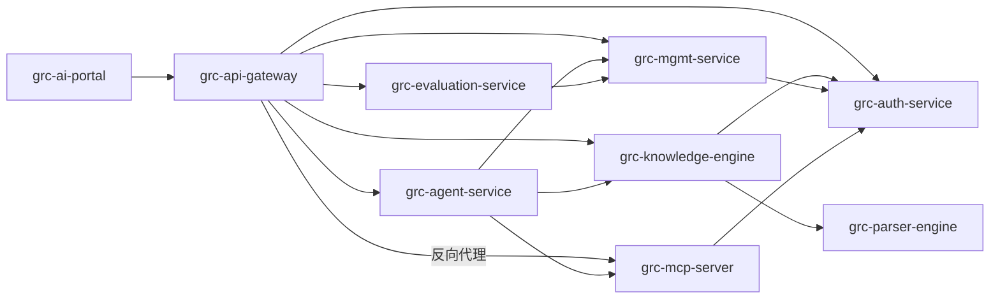

# 服务地图（Service Map）

> ★ 所有 agent 的"世界观"：服务清单、职责边界、依赖方向、仓库、owner。
> ★ 也是**机器可读**的：契约变更的消费者确认、memory-digest 提炼等流程
>   都以本文件为准。请严格遵守下方"机器可读约定"。
> ★ **上游事实源**：项目启动时本文件由
>   [`services.manifest.yaml`](services.manifest.yaml) 经 `/onboard-services` 批量生成；
>   之后保持两者一致（新增服务同时回填清单）。

## 机器可读约定（勿破坏格式）

每个服务用一个三级标题起头，段内包含结构化字段：

```
### <service-name>
- repo: <owner>/<repo>            # 服务仓库（必填，同级 clone 的来源）
- owner: @<github-handle>         # 负责人
- provides: contracts/openapi/<svc>.yaml, contracts/events/<domain>.asyncapi.yaml
- consumes: contracts/openapi/<other>.yaml, contracts/events/<domain>.asyncapi.yaml
- depends-on: <service-name>, ...
```

- `provides` / `consumes` 的值是**契约文件路径**（逗号分隔，可空）。
- `depends-on` 用于依赖方向校验（不得成环）。

---

## 依赖关系图



---

## 服务清单

### grc-ai-portal
- repo: mercedes-benz.china/grc-ai-portal
- owner: @todo-owner
- provides:
- consumes: contracts/openapi/grc-api-gateway.yaml
- depends-on: grc-api-gateway

### grc-api-gateway
- repo: mercedes-benz.china/grc-api-gateway
- owner: @todo-owner
- provides: contracts/openapi/grc-api-gateway.yaml
- consumes: contracts/openapi/grc-auth-service.yaml, contracts/openapi/grc-mgmt-service.yaml, contracts/openapi/grc-agent-service.yaml, contracts/openapi/grc-evaluation-service.yaml, contracts/openapi/grc-knowledge-engine.yaml
- depends-on: grc-auth-service, grc-mgmt-service, grc-agent-service, grc-evaluation-service, grc-knowledge-engine, grc-mcp-server

### grc-auth-service
- repo: mercedes-benz.china/grc-auth-service
- owner: @todo-owner
- provides: contracts/openapi/grc-auth-service.yaml
- consumes:
- depends-on:

### grc-mgmt-service
- repo: mercedes-benz.china/grc-mgmt-service
- owner: @todo-owner
- provides: contracts/openapi/grc-mgmt-service.yaml, contracts/events/eval-task.asyncapi.yaml, contracts/events/notification.asyncapi.yaml
- consumes: contracts/events/eval-result.asyncapi.yaml
- depends-on: grc-auth-service

### grc-agent-service
- repo: mercedes-benz.china/grc-agent-service
- owner: @todo-owner
- provides: contracts/openapi/grc-agent-service.yaml
- consumes: contracts/openapi/grc-knowledge-engine.yaml, contracts/openapi/grc-mgmt-service.yaml
- depends-on: grc-knowledge-engine, grc-mgmt-service, grc-mcp-server

### grc-evaluation-service
- repo: mercedes-benz.china/grc-evaluation-service
- owner: @todo-owner
- provides: contracts/openapi/grc-evaluation-service.yaml
- consumes: contracts/events/eval-task.asyncapi.yaml
- depends-on: grc-mgmt-service

### grc-knowledge-engine
- repo: mercedes-benz.china/grc-knowledge-engine
- owner: @todo-owner
- provides: contracts/openapi/grc-knowledge-engine.yaml, contracts/events/knowledge-build.asyncapi.yaml
- consumes: contracts/openapi/grc-parser-engine.yaml
- depends-on: grc-auth-service, grc-parser-engine

### grc-parser-engine
- repo: mercedes-benz.china/grc-parser-engine
- owner: @todo-owner
- provides: contracts/openapi/grc-parser-engine.yaml
- consumes:
- depends-on:

### grc-mcp-server
- repo: mercedes-benz.china/grc-mcp-server
- owner: @todo-owner
- provides:
- consumes:
- depends-on: grc-auth-service
- 职责：`[待确认]` 示例服务，用于验证脚手架与管线。边界见 000-platform。

---

## 变更规则

- **项目启动、服务已批量拆解** → 先填 [`services.manifest.yaml`](services.manifest.yaml)，
  再用 `/onboard-services` 一次性生成本文件与记忆卡。
- **日常新增单个服务** → 用 `/new-service` skill（`capabilities/skills/new-service`）孵化，
  在此登记一段，**并回填 `services.manifest.yaml`** 保持一致。
- **新增依赖** → 先在此更新 `depends-on` / `consumes`，再改代码（宪法第四条）。
- 依赖方向必须单向无环；如需反向依赖，改为事件解耦并写 ADR。
