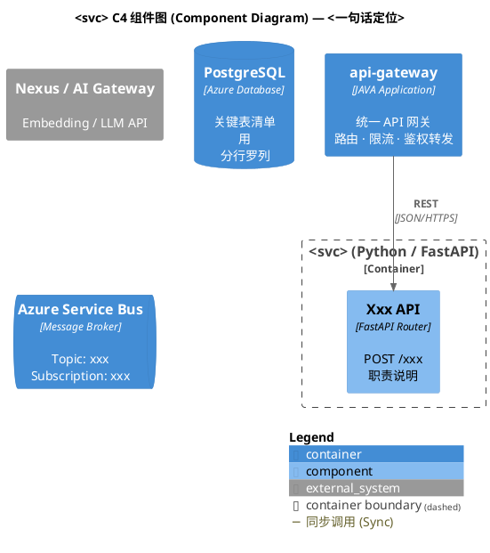

# C4 主题约定（本项目）

提炼自根目录三张实际架构图：
`AI 基础平台-C4架构图.puml`（容器图）、`knowledge-engine-C4组件图.puml`、
`parser-engine-C4组件图.puml`（组件图）。新图保持同一风格。

## 命名约定

- 文件名：平台容器图 `<系统名>-C4架构图.puml`；服务组件图 `<svc>-C4组件图.puml`。
- `@startuml` 图名与文件名（去扩展名）一致。
- alias 用 snake_case，与服务名对应：`api_gateway`、`knowledge_engine`。

## 标准骨架



## 元素选型

| 元素 | 宏 | 用途（本项目实例） |
|---|---|---|
| 人员 | `Person(alias, "名", "职责")` | 管理员/运营/开发人员 |
| 外部系统 | `System_Ext` | SSO、LLM 网关、GitHub、GPU、模型目录 |
| 服务/应用 | `Container(alias, "名", "Container: 技术栈", "职责\n分行")` | ai-portal、api-gateway 等 |
| 数据存储 | `ContainerDb` | PostgreSQL、Redis、Milvus、Blob、Key Vault |
| 消息队列 | `ContainerQueue` | Azure Service Bus（描述里写 topic 名） |
| 系统边界 | `System_Boundary` / `Container_Boundary` | 系统整体 / 单服务内部（可嵌套子边界） |
| 组件 | `Component(alias, "名", "技术", "职责")` | Router/Service/Port/Adapter/Repo |

## 关系写法

```plantuml
Rel(a, b, "动作说明", "协议", $tags="sync")   ' 完整形式
Rel(a, b, " ", $tags="sync")                 ' 并列省文字
BiRel(a, b, "双向语义", $tags="sync")         ' 双向读写
Rel(queue, svc, "订阅 xxx", $tags="sync")     ' 消息订阅: 队列 → 消费者
```

- `$tags="sync"`（实线）：进程内调用、REST 请求、SQL、缓存、gRPC。
- `$tags="async"`（虚线）：出边界的外部调用（LLM/SSO/GitHub）、MQ 投递、
  链路上报（Langfuse）、模型/GPU 加载。
- 协议参数按需写：`HTTPS`、`JSON/HTTP`、`JDBC`、`asyncpg`、`AMQP`、
  `gRPC`、`OAuth2/OIDC`、`MCP Protocol`、`A2A`、`streamble-http`。
- 结尾必须 `SHOW_LEGEND()`。

## 描述文字风格

- 中文为主，技术名词保留英文；多条职责用 `\n1. …\n2. …` 或 `\n` 分行。
- 并列项用 ` · ` 分隔：`路由 · 限流 · 鉴权转发`。
- API 组件描述写方法+路径：`POST /api/v1/parse`。
